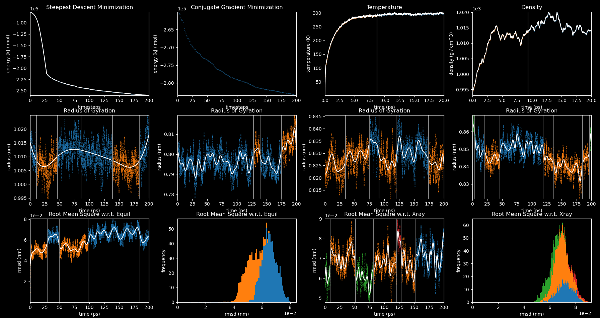

# Timeseries Plots

Tools for analyzing and plotting timeseries data in realtime

## Documentation
The documentation is available on [readthedocs](https://timeseriesplots.readthedocs.io/en/latest/).

## Quick Start

```
git clone https://github.com/jfennick/timeseriesplots.git
cd timeseriesplots

cd install/
./install_conda.sh
conda create --name tsp
conda activate tsp
./install_pypy.sh  # Optional, skip on Arm Macs
./install_system_deps.sh
cd ..

pip install -e ".[all]"
```

The `timeseriesplots` command will watch a directory (recursively, default .) for files containing timeseries data and plot them in realtime.

```
timeseriesplots <watchdir> <pat1> <pat2> <...>
```


